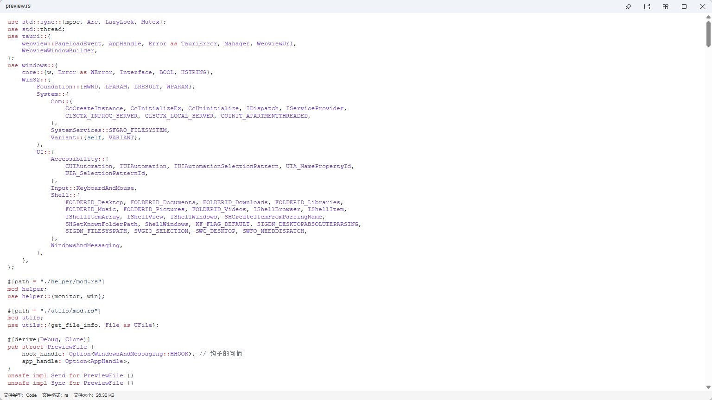
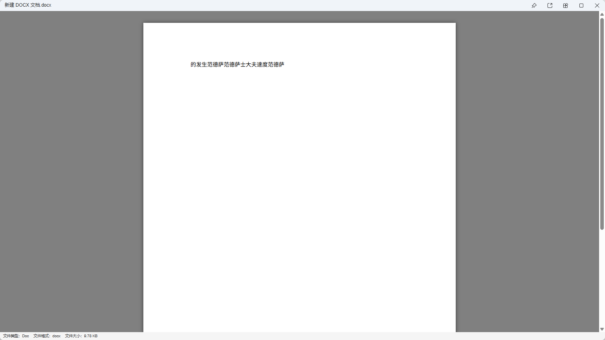
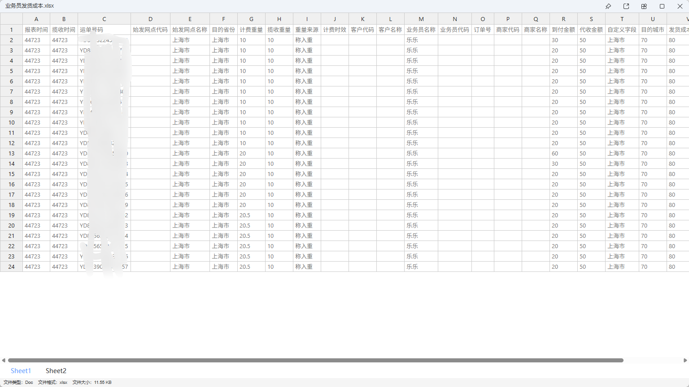
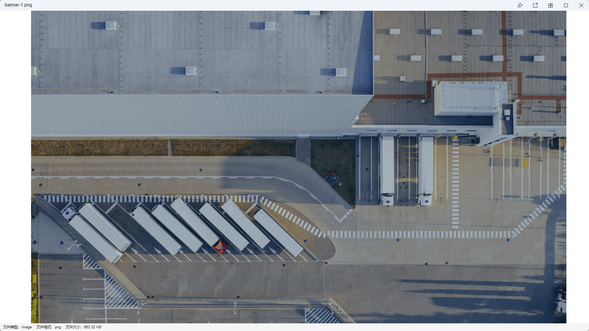
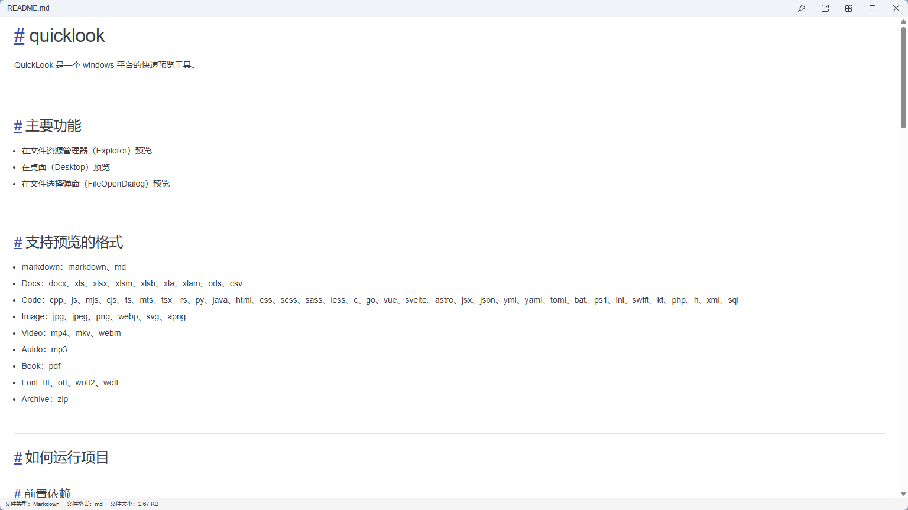
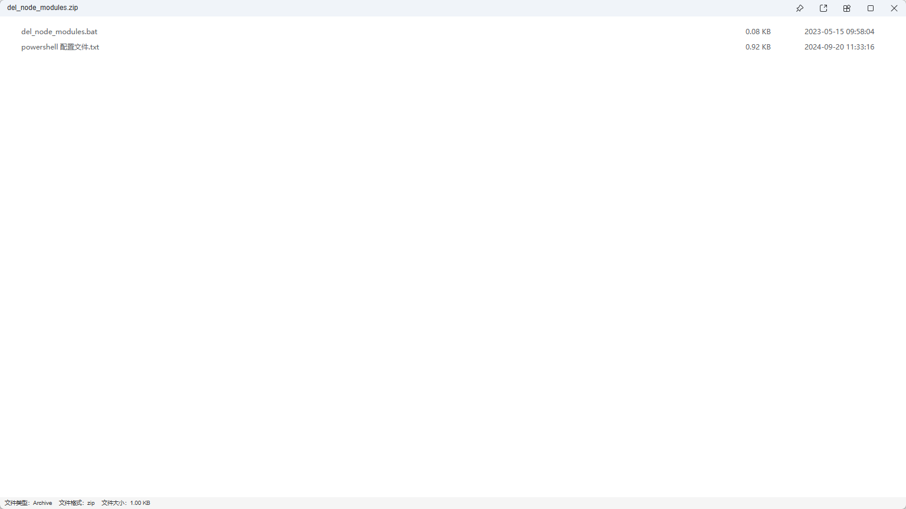

# quicklook

QuickLook 是一个 windows 平台的快速预览工具。

## 主要功能

- 在文件资源管理器（Explorer）预览
- 在桌面（Desktop）预览
- 在文件选择弹窗（FileOpenDialog）预览

## 支持预览的格式

- markdown：markdown、md
- Docs：docx、xls、xlsx、xlsm、xlsb、xla、xlam、ods、csv
- Code：cpp、js、mjs、cjs、ts、mts、tsx、rs、py、java、html、css、scss、sass、less、styl、c、cs、go、vue、svelte、astro、jsx、json、yml、yaml、toml、bat、ps1、ini、swift、kt、php、h、xml、sql、pug、lua、r、d、vb、pas、scala、m
- Image：jpg、jpeg、png、webp、svg、apng
- Video：mp4、mkv、webm
- Auido：mp3
- Book：pdf
- Font: ttf、otf、woff2、woff
- Archive：zip、tar、gz、tgz、bz2、tbz2、xz、txz、7z

## 如何运行项目

### 前置依赖

- Rust [官方网站](https://www.rust-lang.org/tools/install)
- Tauri [官方网站](https://tauri.app/start/prerequisites/)
- NodeJS [官方网站](https://nodejs.org/)
- vcpkg (Windows 平台需要，用于管理 FFmpeg 等 C++ 依赖)

### 安装 C++ 依赖 (Windows)

#### 使用 vcpkg 安装 FFmpeg

**自动安装 (推荐)**:

运行项目提供的自动安装脚本:

```bash
# Windows (PowerShell - 推荐)
.\scripts\setup-vcpkg.ps1

# Windows (Command Prompt)
.\scripts\setup-vcpkg.bat

# Linux/macOS
./scripts/setup-vcpkg.sh
```

**手动安装**:

1. 安装 vcpkg：
```bash
git clone https://github.com/microsoft/vcpkg.git
cd vcpkg
.\bootstrap-vcpkg.bat
```

2. 设置环境变量：
```bash
# 设置 VCPKG_ROOT 环境变量指向 vcpkg 安装目录
set VCPKG_ROOT=C:\path\to\vcpkg
```

3. 安装 FFmpeg 依赖：
```bash
# x64 系统
vcpkg install --triplet x64-windows-static-md

# ARM64 系统
vcpkg install --triplet aarch64-windows-static-md
```

> **注意**: vcpkg 会根据项目根目录的 `vcpkg.json` 文件自动安装所需的包。首次安装可能需要较长时间，但后续构建会利用缓存加速。

### 拉取项目代码

```bash
git clone https://github.com/GuoJikun/quicklook.git 
```

### 运行项目

> 推荐使用 pnpm

```bash
pnpm i #安装项目依赖
pnpm tauri dev 运行项目
```

### 打包

```bash
pnpm tauri build
```

## 故障排除

### Windows 构建问题

如果在 Windows 上遇到 FFmpeg 相关的链接错误，请检查：

1. **VCPKG_ROOT 环境变量是否设置**：
   ```cmd
   echo %VCPKG_ROOT%
   ```

2. **FFmpeg 是否通过 vcpkg 正确安装**：
   ```cmd
   vcpkg list | findstr ffmpeg
   ```

3. **使用正确的 triplet**：
   - x64 系统使用 `x64-windows-static-md`
   - ARM64 系统使用 `aarch64-windows-static-md`

4. **清理并重建**：
   ```bash
   cargo clean
   pnpm tauri build
   ```

更多详细的 vcpkg 配置和故障排除信息，请参阅 [VCPKG.md](VCPKG.md)。

## TODO

> 带 √ 为已经完成

- 支持的预览格式
  - 图片:
    - [x] svg
    - [x] png
    - [x] apng
    - [x] jpg
    - [x] jpeg
    - [x] gif
    - [x] bmp
    - [x] webp
  - Markdown:
    - [x] md
    - [x] markdown
  - 文档:
    - [x] xlsx
    - [x] xls
    - [x] xlsm
    - [x] xlsb
    - [x] xla
    - [x] xlam
    - [x] ods
    - [x] csv
    - [x] docx
  - 文本文件(utf8):
    - [x] cpp
    - [x] js
    - [x] mjs
    - [x] cjs
    - [x] ts
    - [x] mts
    - [x] tsx
    - [x] rs
    - [x] py
    - [x] java
    - [x] html
    - [x] css
    - [x] scss
    - [x] sass
    - [x] less
    - [x] styl
    - [x] c
    - [x] cs
    - [x] go
    - [x] vue
    - [x] svelte
    - [x] astro
    - [x] jsx
    - [x] json
    - [x] yml
    - [x] yaml
    - [x] toml
    - [x] bat
    - [x] ps1
    - [x] ini
    - [x] swift
    - [x] kt
    - [x] php
    - [x] h
    - [x] xml
    - [x] sql
    - [x] pug
    - [x] lua
    - [x] r
    - [x] d
    - [x] vb
    - [x] pas
    - [x] scala
    - [x] m
  - 字体:
    - [x] ttf
    - [x] otf
    - [x] woff
    - [x] woff2
  - 书籍:
    - [x] pdf
  - 视频:
    - [x] mkv
    - [x] mp4
    - [x] webm
  - 压缩文件:
    - [x] zip
    - [x] tar
    - [x] gz
    - [x] tgz
    - [x] bz2
    - [x] tbz2
    - [x] xz
    - [x] txz
    - [x] 7z
- 设置
  - [x] 支持格式的显示
  - [ ] 版本显示以及更新
  - [x] 自启动

## 使用到的开源软件

- csv: 解析 csv 文件
- calamine: 解析 Excel 文件
- vitepress 的样式
- zip: 解析 zip 格式的文件
- docx-preview
- image
- windows: windows api
- tauri: 一个跨平台应用开发框架
- markdown-it: 解析 md 文件
- handsontable: 显示解析后的 excel 文件和 csv 文件的内容
- pdfjs-dist: 解析 pdf 并显示
- shiki: 解析代码文件和样式显示
- vue: 前端使用的框架

## 软件截图

### 预览 Code (utf-8)



### 预览 Docx



### 预览 Excel



### 预览 Image



### 预览 Md



### 预览 Pdf


### 预览 Zip


