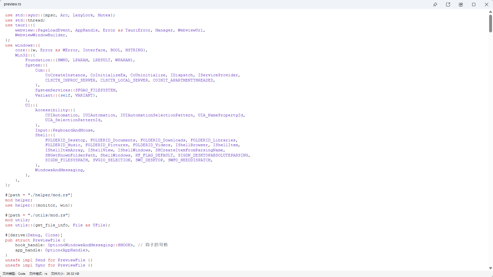
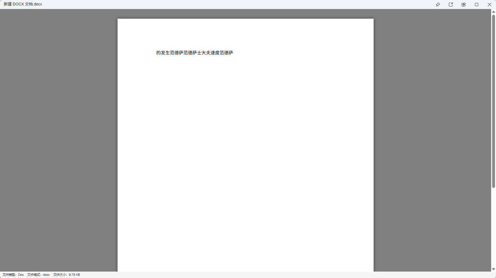
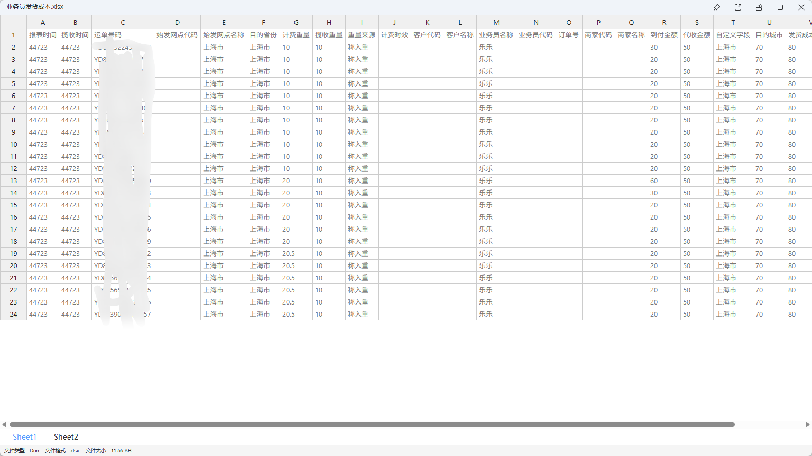
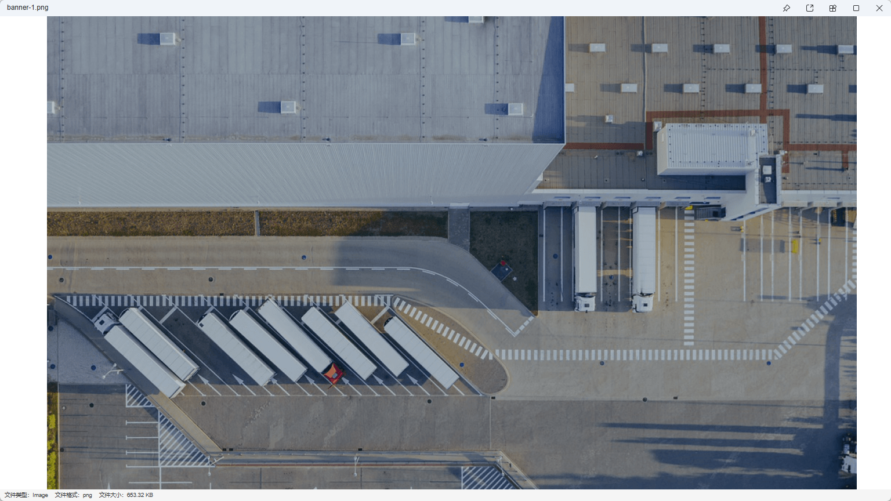
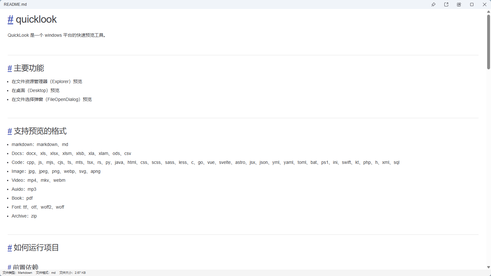
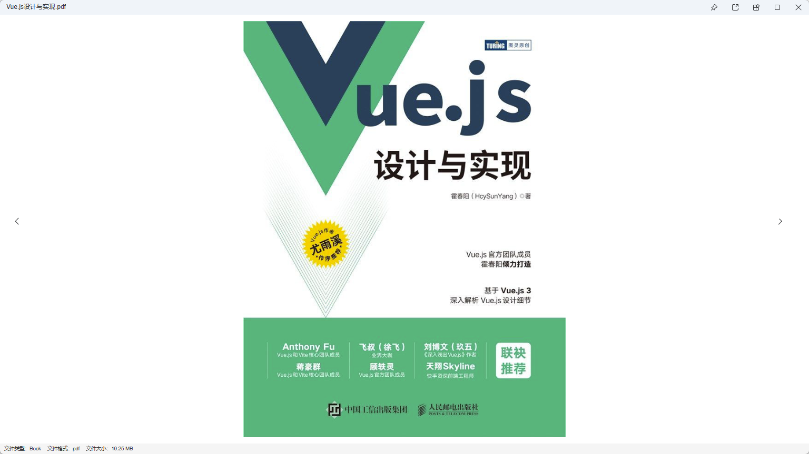
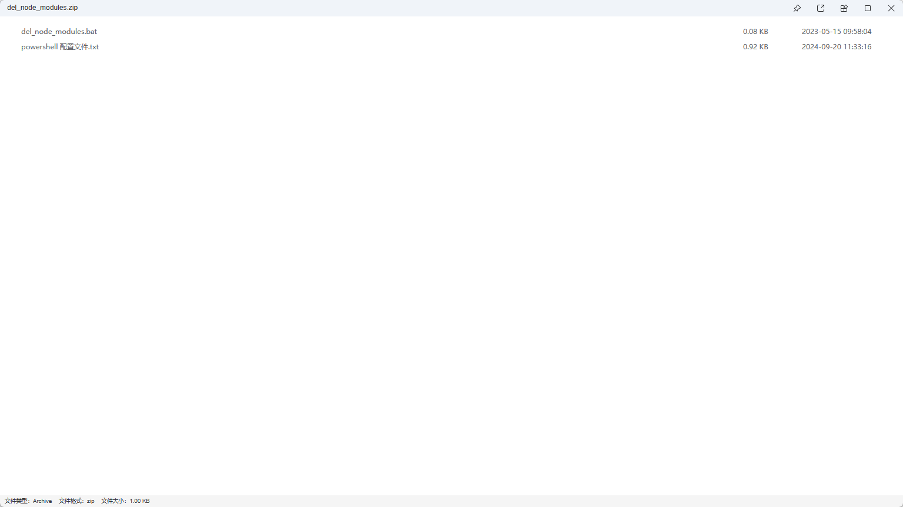
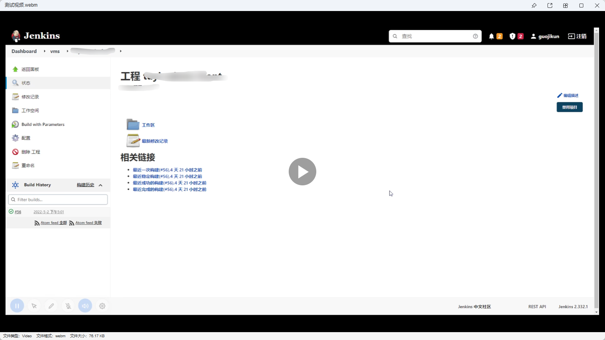

# quicklook

QuickLook 是一个 windows 平台的快速预览工具。

## 主要功能

- 在文件资源管理器（Explorer）预览
- 在桌面（Desktop）预览
- 在文件选择弹窗（FileOpenDialog）预览

## 支持预览的格式

- Markdown：markdown、md
- Doc：docx、xls、xlsx、xlsm、xlsb、xla、xlam、ods、csv
- Code：txt、cpp、js、mjs、cjs、ts、mts、tsx、rs、py、java、html、css、scss、sass、less、styl、c、cs、go、vue、svelte、astro、jsx、json、yml、yaml、toml、bat、ps1、ini、swift、kt、php、h、xml、sql、pug、lua、r、d、vb、pas、scala、dart、rb、m、log、bash、zig
- Image：jpg、jpeg、png、gif、webp、bmp、ico、svg、apng、psd、tiff、tif、tga、pbm、pgm、ppm、qoi、exr、heic、heif、jxl
- Video：mp4、webm、mkv、avi、mov、wmv、mpg、mpeg、m4v、3gp、3g2
- Audio：mp3、ogg、m4a
- Book：epub、mobi
- Font：ttf、otf、woff2、woff
- Archive：zip、7z、rar、tar、gz、tgz、bz2、tbz2、xz、txz、zst、tzst、cpio、ar、a、deb、jar、war、ear、apk、aar、whl、vsix、nupkg、crx、xpi、egg、kra、xps、oxps
- 3D Model：gltf、glb、stl、obj、ply、fbx、3mf、dae、3ds、amf、wrl、lwo、lws

## 如何运行项目

### 前置依赖

- Rust [官方网站](https://www.rust-lang.org/tools/install)
- Tauri [官方网站](https://tauri.app/start/prerequisites/)
- NodeJS [官方网站](https://nodejs.org/)

### 拉取项目代码

```bash
git clone https://github.com/GuoJikun/quicklook.git 
```

### 运行项目

> 推荐使用 pnpm；
> 使用 Volta 来锁定 NodeJS 和 pnpm 版本

```bash
pnpm i #安装项目依赖
pnpm tauri dev 运行项目
```

### 打包

```bash
pnpm tauri build
```

## 使用到的开源软件

详见 [THIRD_PARTY_LIB.md](./THIRD_PARTY_LIB.md)

## 软件截图

### 预览 Code (utf-8)



### 预览 Docx



### 预览 Excel



### 预览 Image



### 预览 Md



### 预览 Pdf



### 预览 Zip



### 预览 Video



### 预览 Audio


## License/许可证

项目使用了 MIT 和 Apache 2.0。
